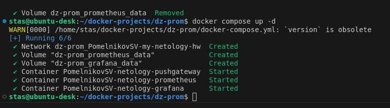
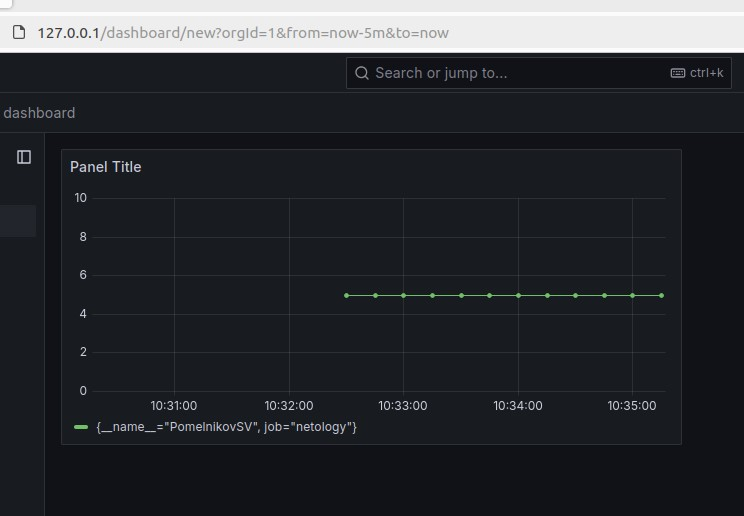
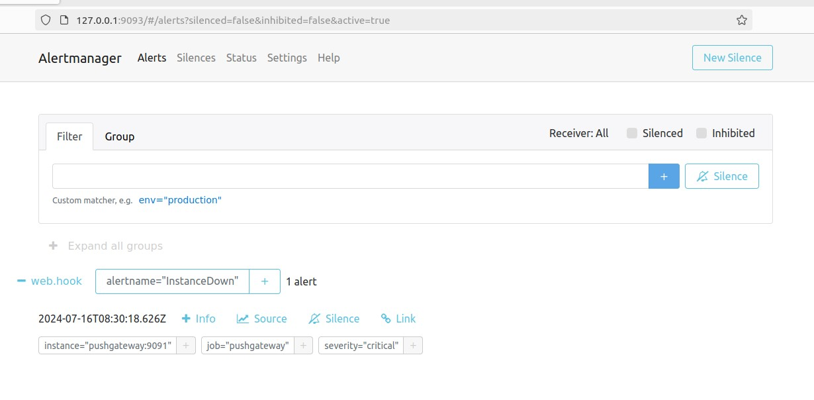

# Домашнее задание к занятию "`6-04 Docker. Часть 2`" - `Pomelnikov Stanislav`


### Задание 1

`Установите Docker Compose и опишите, для чего он нужен и как может улучшить вашу жизнь`

1. `Docker Compose упрощает задачи, связанные с Docker, за счет возможности определять и запускать многоконтейнерные приложения с помощью одного YAML-файла. Этот файл позволяет легко управлять зависимостями между контейнерами, их сетевыми настройками и общими конфигурациями, что значительно упрощает процесс развертывания и масштабирования приложений. В отличие от Dockerfile, который предназначен для создания индивидуальных образов, Docker Compose предоставляет инструменты для оркестрации и управления несколькими контейнерами. Используя команды docker-compose up и docker-compose down, можно быстро запускать и останавливать весь набор контейнеров, что делает управление инфраструктурой более эффективным и удобным.`


### Задание 2

`Создайте файл docker-compose.yml и внесите туда первичные настройки:`

`version;`  
`services;`  
`volumes;`  
`networks.`  

`При выполнении задания используйте подсеть 10.5.0.0/16. Ваша подсеть должна называться: <ваши фамилия и инициалы>-my-netology-hw. Все приложения из последующих заданий должны находиться в этой конфигурации.`


### Задание 3

1. `Создайте конфигурацию docker-compose для Prometheus с именем контейнера <ваши фамилия и инициалы>-netology-prometheus.`
2. `Добавьте необходимые тома с данными и конфигурацией (конфигурация лежит в репозитории в директории 6-04/prometheus).`
3. `Обеспечьте внешний доступ к порту 9090 c докер-сервера.`


### Задание 4

1. `Создайте конфигурацию docker-compose для Pushgateway с именем контейнера <ваши фамилия и инициалы>-netology-pushgateway.`
2. `Обеспечьте внешний доступ к порту 9091 c докер-сервера.`


### Задание 5

1. `Создайте конфигурацию docker-compose для Grafana с именем контейнера <ваши фамилия и инициалы>-netology-grafana.`
2. `Добавьте необходимые тома с данными и конфигурацией (конфигурация лежит в репозитории в директории 6-04/grafana).`
3. `Добавьте переменную окружения с путем до файла с кастомными настройками (должен быть в томе), в самом файле пропишите логин=<ваши фамилия и инициалы> пароль=netology.`
4. `Обеспечьте внешний доступ к порту 3000 c порта 80 докер-сервера.`

### Задание 6

1. `Настройте поочередность запуска контейнеров.`
2. `Настройте режимы перезапуска для контейнеров.`
3. `Настройте использование контейнерами одной сети.`
4. `Запустите сценарий в detached режиме.`


### Задание 7

1. `Выполните запрос в Pushgateway для помещения метрики <ваши фамилия и инициалы> со значением 5 в Prometheus: echo "<ваши фамилия и инициалы> 5" | curl --data-binary @- http://localhost:9091/metrics/job/netology.`
2. `Залогиньтесь в Grafana с помощью логина и пароля из предыдущего задания.`
3. `Cоздайте Data Source Prometheus (Home -> Connections -> Data sources -> Add data source -> Prometheus -> указать "Prometheus server URL = http://prometheus:9090" -> Save & Test).`
4. `Создайте график на основе добавленной в пункте 5 метрики (Build a dashboard -> Add visualization -> Prometheus -> Select metric -> Metric explorer -> <ваши фамилия и инициалы -> Apply.`

В качестве решения приложите:

docker-compose.yml целиком;
скриншот команды docker ps после запуске docker-compose.yml;
скриншот графика, постоенного на основе вашей метрики.

```
version: '3.7'

volumes:
  prometheus_data: {}
  grafana_data: {}

networks:
  PomelnikovSV-my-netology-hw:
    driver: bridge
    ipam:
      config:
        - subnet: 10.5.0.0/16

services:
  prometheus:
    image: prom/prometheus:v2.36.2
    container_name: PomelnikovSV-netology-prometheus
    volumes:
      - ./prometheus/:/etc/prometheus/
      - prometheus_data:/prometheus
    command:
      - '--config.file=/etc/prometheus/prometheus.yml'
      - '--storage.tsdb.path=/prometheus'
      - '--web.console.libraries=/usr/share/prometheus/console_libraries'
      - '--web.console.templates=/usr/share/prometheus/consoles'
    ports:
      - 9090:9090
    links:
      - pushgateway:pushgateway
    depends_on:
      - pushgateway
    networks:
      - PomelnikovSV-my-netology-hw
    restart: always

  grafana:
    image: grafana/grafana
    container_name: PomelnikovSV-netology-grafana
    user: "472"
    depends_on:
      - prometheus
    ports:
      - 80:3000
    volumes:
      - grafana_data:/var/lib/grafana
      - ./grafana/custom.ini:/etc/grafana/custom.ini
    environment:
      - GF_PATHS_CONFIG=/etc/grafana/custom.ini
    networks:
      - PomelnikovSV-my-netology-hw
    restart: always

  pushgateway:
    image: prom/pushgateway
    container_name: PomelnikovSV-netology-pushgateway
    restart: always
    expose:
      - 9091
    ports:
      - "9091:9091"
    networks:
      - PomelnikovSV-my-netology-hw

```



### Задание 8

1. `Остановите и удалите все контейнеры одной командой.`

В качестве решения приложите скриншот консоли с проделанными действиями.


### Задание 9

1. `Создайте конфигурацию docker-compose для Alertmanager с именем контейнера <ваши фамилия и инициалы>-netology-alertmanager.`
2. `Добавьте необходимые тома с данными и конфигурацией, сеть, режим и очередность запуска.`
3. `Обновите конфигурацию Prometheus (необходимые изменения ищите в презентации или документации) и перезапустите его.`

В качестве решения приложите скриншот с событием из Alertmanager.



### Задание 10

`Приведите ответ в свободной форме........`

1. `Заполните здесь этапы выполнения, если требуется ....`
2. `Заполните здесь этапы выполнения, если требуется ....`
3. `Заполните здесь этапы выполнения, если требуется ....`
4. `Заполните здесь этапы выполнения, если требуется ....`
5. `Заполните здесь этапы выполнения, если требуется ....`
6. 

```
Поле для вставки кода...
....
....
....
....
```

`При необходимости прикрепитe сюда скриншоты
`
