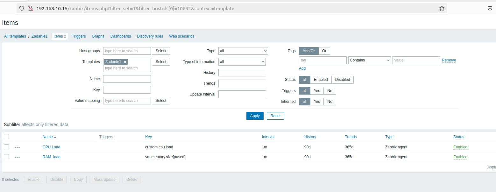

# Домашнее задание к занятию «Система мониторинга Zabbix. Часть 2» - Помельников Станислав

---

### Задание 1

Создайте свой шаблон, в котором будут элементы данных, мониторящие загрузку CPU и RAM хоста.  

Процесс выполнения  
Выполняя ДЗ сверяйтесь с процессом отражённым в записи лекции.  
В веб-интерфейсе Zabbix Servera в разделе Templates создайте новый шаблон  
Создайте Item который будет собирать информацию об загрузке CPU в процентах  
Создайте Item который будет собирать информацию об загрузке RAM в процентах  

Требования к результату  
Прикрепите в файл README.md скриншот страницы шаблона с названием «Задание 1»  

### Решение 1

---

### Задание 2

Добавьте в Zabbix два хоста и задайте им имена <фамилия и инициалы-1> и <фамилия и инициалы-2>. Например: ivanovii-1 и ivanovii-2.  

Процесс выполнения  
Выполняя ДЗ сверяйтесь с процессом отражённым в записи лекции.  
Установите Zabbix Agent на 2 виртмашины, одной из них может быть ваш Zabbix Server  
Добавьте Zabbix Server в список разрешенных серверов ваших Zabbix Agentов  
Добавьте Zabbix Agentов в раздел Configuration > Hosts вашего Zabbix Servera  
Прикрепите за каждым хостом шаблон Linux by Zabbix Agent  
Проверьте что в разделе Latest Data начали появляться данные с добавленных агентов  

Требования к результату  
 Результат данного задания сдавайте вместе с заданием 3 

---

### Задание 3

**Что нужно сделать:**

1. Создайте новую ветку dev и переключитесь на неё.
2. Создайте в ветке dev файл test.sh с произвольным содержимым.
3. Сделайте несколько коммитов и пушей  в ветку dev, имитируя активную работу над  файлом в процессе разработки.
4. Переключитесь на основную ветку.
5. Добавьте файл main.sh в основной ветке с произвольным содержимым, сделайте комит и пуш . Так имитируется продолжение общекомандной разработки в основной ветке во время разработки отдельного функционала в dev  ветке.
6. Сделайте мердж dev  ветки в основную с помощью git merge dev. Напишите осмысленное сообщение в появившееся окно комита.
7. Сделайте пуш в основной ветке.
8. Не удаляйте ветку dev.

В качестве ответа прикрепите ссылку на граф коммитов https://github.com/ваш-логин/ваш-репозиторий/network в ваш md-файл с решением.

Ваш граф комитов должен выглядеть аналогично скриншоту:   

### Решение 3
https://github.com/Stas-91/github_dz/network

---
## Дополнительные задания* (со звёздочкой)

Их выполнение необязательное и не влияет на получение зачёта по домашнему заданию. Можете их решить, если хотите лучше разобраться в материале.

---
### Задание 4*

Сэмулируем конфликт. Перед выполнением изучите [документацию](https://git-scm.com/book/ru/v2/%D0%98%D0%BD%D1%81%D1%82%D1%80%D1%83%D0%BC%D0%B5%D0%BD%D1%82%D1%8B-Git-%D0%9F%D1%80%D0%BE%D0%B4%D0%B2%D0%B8%D0%BD%D1%83%D1%82%D0%BE%D0%B5-%D1%81%D0%BB%D0%B8%D1%8F%D0%BD%D0%B8%D0%B5).

**Что нужно сделать:**

1. Создайте ветку conflict и переключитесь на неё.
2. Внесите изменения в файл test.sh. 
3. Сделайте коммит и пуш.
4. Переключитесь на основную ветку.
5. Измените ту же самую строчку в файле test.sh.
6. Сделайте коммит и пуш.
7. Сделайте мердж ветки conflict в основную ветку и решите конфликт так, чтобы в результате в файле оказался код из ветки conflict.

В качестве ответа на задание прикрепите ссылку на граф коммитов https://github.com/ваш-логин/ваш-репозиторий/network в ваш md-файл с решением.

### Решение 3
https://github.com/Stas-91/github_dz/network
