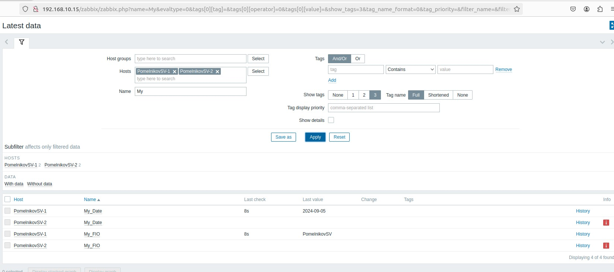

# Домашнее задание к занятию «Система мониторинга Zabbix. Часть 2» - Помельников Станислав


---

### Задание 1

Создайте свой шаблон, в котором будут элементы данных, мониторящие загрузку CPU и RAM хоста.  

Процесс выполнения  
Выполняя ДЗ сверяйтесь с процессом отражённым в записи лекции.  
В веб-интерфейсе Zabbix Servera в разделе Templates создайте новый шаблон  
Создайте Item который будет собирать информацию об загрузке CPU в процентах  
Создайте Item который будет собирать информацию об загрузке RAM в процентах  

Требования к результату  
Прикрепите в файл README.md скриншот страницы шаблона с названием «Задание 1»  

### Решение 1


---

### Задание 2

Добавьте в Zabbix два хоста и задайте им имена <фамилия и инициалы-1> и <фамилия и инициалы-2>. Например: ivanovii-1 и ivanovii-2.  

Процесс выполнения  
Выполняя ДЗ сверяйтесь с процессом отражённым в записи лекции.  
Установите Zabbix Agent на 2 виртмашины, одной из них может быть ваш Zabbix Server  
Добавьте Zabbix Server в список разрешенных серверов ваших Zabbix Agentов  
Добавьте Zabbix Agentов в раздел Configuration > Hosts вашего Zabbix Servera  
Прикрепите за каждым хостом шаблон Linux by Zabbix Agent  
Проверьте что в разделе Latest Data начали появляться данные с добавленных агентов  

Требования к результату  
 Результат данного задания сдавайте вместе с заданием 3 

---

### Задание 3

Привяжите созданный шаблон к двум хостам. Также привяжите к обоим хостам шаблон Linux by Zabbix Agent.  
  
Процесс выполнения  
Выполняя ДЗ сверяйтесь с процессом отражённым в записи лекции.    
Зайдите в настройки каждого хоста и в разделе Templates прикрепите к этому хосту ваш шаблон  
Так же к каждому хосту привяжите шаблон Linux by Zabbix Agent  
Проверьте что в раздел Latest Data начали поступать необходимые данные из вашего шаблона  

Требования к результату  
 Прикрепите в файл README.md скриншот страницы хостов, где будут видны привязки шаблонов с названиями «Задание 2-3». Хосты должны иметь зелёный статус подключения  

### Решение 3


---

### Задание 4

Создайте свой кастомный дашборд.  

Процесс выполнения  
Выполняя ДЗ сверяйтесь с процессом отражённым в записи лекции.  
В разделе Dashboards создайте новый дашборд  
Разместите на нём несколько графиков на ваше усмотрение.  

Требования к результату  
 Прикрепите в файл README.md скриншот дашборда с названием «Задание 4»  
 
### Решение 4


---
## Дополнительные задания* (со звёздочкой)

Их выполнение необязательное и не влияет на получение зачёта по домашнему заданию. Можете их решить, если хотите лучше разобраться в материале.

---
### Задание 5*

Создайте карту и расположите на ней два своих хоста.  

Процесс выполнения  
Настройте между хостами линк.  
Привяжите к линку триггер, связанный с agent.ping одного из хостов, и установите индикатором сработавшего триггера красную пунктирную линию.  
Выключите хост, чей триггер добавлен в линк. Дождитесь срабатывания триггера.  

Требования к результату  
 Прикрепите в файл README.md скриншот карты, где видно, что триггер сработал, с названием «Задание 5»  

### Решение 5


---
### Задание 6*

Создайте UserParameter на bash и прикрепите его к созданному вами ранее шаблону. Он должен вызывать скрипт, который:  

при получении 1 будет возвращать ваши ФИО,  
при получении 2 будет возвращать текущую дату.  

Требования к результату  
 Прикрепите в файл README.md код скрипта, а также скриншот Latest data с результатом работы скрипта на bash, чтобы был виден результат работы скрипта при отправке в него 1 и 2  

### Решение 6

```
#!/bin/bash

case $1 in
    1)
        echo "PomelnikovSV"
        ;;
    2)
        echo $(date "+%Y-%m-%d")
        ;;
    *)
        echo "Error: Invalid parameter"
        exit 1
        ;;
esac

```



---
### Задание 7*

Доработайте Python-скрипт из лекции, создайте для него UserParameter и прикрепите его к созданному вами ранее шаблону. Скрипт должен:  

при получении 1 возвращать ваши ФИО,  

при получении 2 возвращать текущую дату,  

делать всё, что делал скрипт из лекции.  

 Прикрепите в файл README.md код скрипта в Git. Приложите в Git скриншот Latest data с результатом работы скрипта на Python, чтобы были видны результаты работы скрипта при отправке в него 1, 2, -ping, а также -simple_print.*  

### Решение 7

```
import sys
import os
import re
from datetime import datetime

# Проверка на наличие аргументов
if len(sys.argv) < 2:
    print("Error: No arguments provided")
    sys.exit(1)

# Если введено просто 1 или 2
if sys.argv[1] == '1':
    print("PomelnikovSV")
elif sys.argv[1] == '2':
    print(datetime.now().strftime("%Y-%m-%d"))  # Выводим текущую дату
# Проверяем, что аргументов 2 для других команд
elif len(sys.argv) == 3:
    if sys.argv[1] == '-ping':  # Если -ping
        result = os.popen("ping -c 1 " + sys.argv[2]).read()  # Делаем пинг по заданному адресу
        result = re.findall(r"time=(.*) ms", result)  # Выдёргиваем из результата время
        if result:
            print(result[0])  # Выводим результат в консоль
        else:
            print("Ping failed or no response time found")

    elif sys.argv[1] == '-simple_print':  # Если -simple_print
        print(sys.argv[2])  # Выводим в консоль содержимое sys.argv[2]

    else:  # Если неизвестный ключ
        print(f"unknown input: {sys.argv[1]}")
else:
    print("Error: Invalid number of arguments")
```


